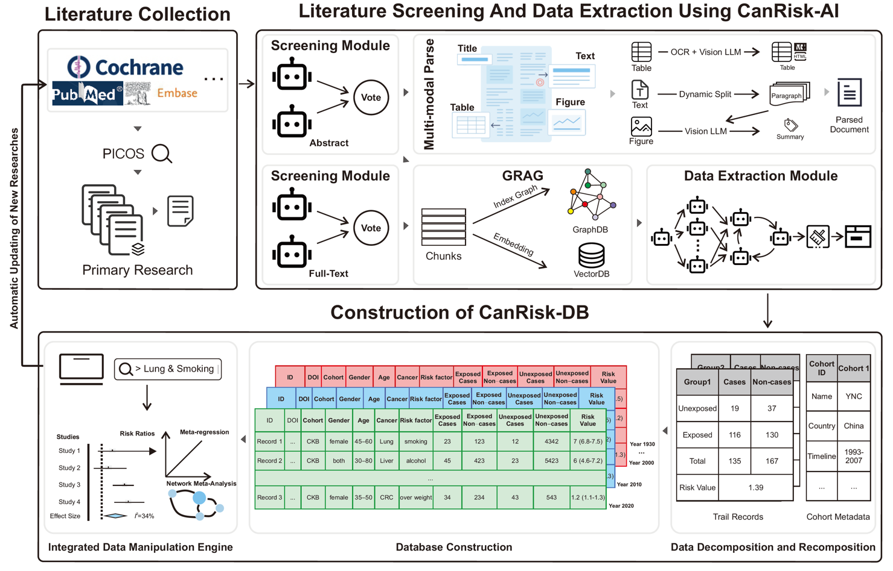

# CanRIsk-AI: An AI pipline for CanRisk-DB

---

[English](./README.md) | [简体中文](./README_zh.md)

## 介绍

[CanRisk-DB](https://www.canrisk-ai.com/) 是一个由AI构建的癌症风险数据库,而 CanRisk-AI 是构建该数据库的流程.
可以通过网页端访问 CanRisk-DB。 整个 CanRisk-AI 流程包括：摘要过滤，全文过滤和多智能体信息提取。整体流程图如下：


## 安装

---
该项目的代码基于Python构建，且需要Python 3.10或更高版本。

### 依赖库

- volcengine-python-sdk

```
pip install -U 'volcengine-python-sdk[ark]'
```

- pandas
- numpy
- cv2
- jinja2
- lightrag (1.2.7, 请注意，LightRAG 的更新非常频繁，不同版本之间的接口存在显著差异。较新的 LightRAG
  版本可能会导致脚本不兼容。)
- nest_asyncio
- openai
- json_repair
- llm2json

## 使用步骤

0. 关于 LLM  
   本项目中所有的大模型调用均来自火山引擎平台，并通过Ark实现。相关信息请访问[火山方舟](https://www.volcengine.com/product/ark).

1. 摘要过滤
    - 本项目中的文献摘要来源于PubMed、Cochrane和Embase。文章发表后，检索策略信息将在补充材料中呈现。
    - 输入文件为`tsv`格式，无需列名。
      第一列包含唯一的摘要ID（可由用户定义），
      第二列包含摘要内容。
   ```shell
   python 1.Abstract_filter.py input_file.tsv output_file.tsv
   ```

2. pdf文档解析
    -
    有很多优秀的pdf文档解析工具可以使用，如 [Dolphin](https://github.com/bytedance/Dolphin), [docling](https://github.com/docling-project/docling),
    和 [LlamaParse](https://cloud.llamaindex.ai/) 等.由于计算资源的限制以及对中间文件（尤其是文献中的图表）利用的考量，
    本项目采用 [MinerU](https://github.com/opendatalab/MinerU) 进行全文解析.

3. 文献全文过滤
    - 输入文件为`tsv`格式，无需列名。第一列包含唯一的文献ID（可由用户定义），第二列包含与文献对应的PDF解析文件的文件路径。
    - 请注意，PDF解析文件应为TXT格式（Markdown格式也可接受）。
   ```shell
   python 2.Full_text_filter.py input_file.tsv output_file.tsv
   ```

4. 构建 CanRisk-DB 的多智能体
   -i：输入目录，支持MinerU解析后的输出结果
   -o：输出目录
   -r：RAG目录，支持LightRAG构建的知识图谱的位置。如果不存在，将在输出目录中自动创建
   ```shell
   python 3.Multi_agent.py -i input_dir -o output_dir -r rag_dir
   ```

## 引用

--- 
相关研究已被欧洲肿瘤内科学会（ESMO）接收，学术论文目前正在评审中。

## 许可证

---
本项目采用MIT许可证授权——详情请参见LICENSE文件。

